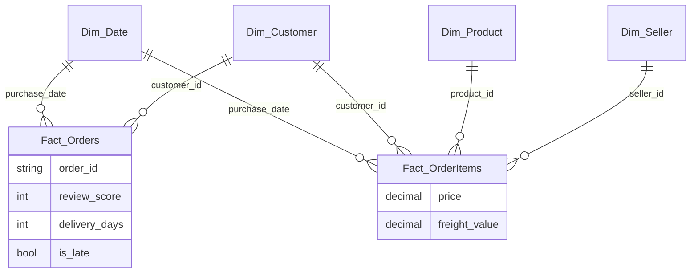

# Olist Delivery Insights: Case Study

> A 5-minute read: problem, data, approach, model, key DAX, insights, impact, and what's next.
> **Figures are drafted from the model and marked `[confirm]`. Verify exact values before publishing.**
> Money is in Brazilian Reais (R$), the dataset's currency; shown with a dollar sign for readability, not US dollars.
> Pair the insights with the dashboard screenshot in `docs/img/` (and `/report/screenshots/`).

## Problem and business question

Olist is a Brazilian marketplace that connects small sellers to customers nationwide. On a marketplace, a late
delivery becomes a 1- or 2-star review, and a bad first experience is what stops people from buying again.
Leadership's question:

> "Late deliveries lower review scores and put repeat revenue at risk. Where is it happening, why, and how much revenue is exposed?"

The report answers that, and attaches a dollar figure to the risk so it can be prioritised.

## Dataset

[Olist Brazilian E-Commerce Public Dataset](https://www.kaggle.com/datasets/olistbr/brazilian-ecommerce): about 100K
orders placed from **Sep 2016 to Oct 2018** across 9 related CSVs (orders, order items, payments, reviews, customers,
products, sellers, geolocation, and a category-name translation). Free for non-commercial use with attribution
(CC BY-NC). Monetary values are in Brazilian Reais. See `ATTRIBUTION.md`.

## Approach

The whole project is authored as code in Power BI Desktop developer mode. The semantic model is in TMDL and the report
is in PBIR, so every table, measure, and visual is a plain-text file that diffs and reviews like source code.

1. **Get the grain right.** Two fact tables at different grains share conformed dimensions.
2. **Shape the data in Power Query (M).** Derive the delivery and satisfaction fields once, in the model, not in DAX.
3. **Write an explicit DAX measure library.** No implicit measures; everything named, formatted, and foldered.
4. **Build one decisive page.** A single executive overview (KPI strip with targets, a delivery-versus-rating scatter,
   a state scorecard, and a dynamic key-insight line) instead of several thinner pages. Deeper exploration happens live
   in a walkthrough; the supporting analysis below was run in the model and in SQL.

## Data model

A star schema with **two fact tables**, the strongest modeling signal, because it forces correct grain handling.

| Table | Grain | Role |
|---|---|---|
| `Dim_Date` | one row per day | Conformed; marked as Date table; drives time intelligence |
| `Dim_Customer` | one row per `customer_id` | Conformed (filters both facts); `Customer State` drives geography |
| `Dim_Product` | one row per `product_id` | Category (translated to English); relates to lines only |
| `Dim_Seller` | one row per `seller_id` | Relates to lines only |
| `Fact_OrderItems` | one row per order line | `price`, `freight_value` (revenue grain) |
| `Fact_Orders` | one row per order | `review_score`, `delivery_days`, `is_late` (delivery and satisfaction grain) |



Date and Customer are **conformed**, so they filter both facts directly. Product and Seller describe order lines, so
they relate only to `Fact_OrderItems`. There is no physical relationship between the two facts on purpose, because that
would create an ambiguous filter path with the conformed dimensions. The cross-grain link is made virtually, in DAX,
only where it is needed (see Revenue at Risk).

## Key DAX

**On-time performance** (over delivered orders, so undelivered orders do not dilute the rate):

```DAX
Late Orders      = CALCULATE ( [Total Orders], Fact_Orders[is_late] = TRUE () )
Delivered Orders = CALCULATE ( [Total Orders], NOT ISBLANK ( Fact_Orders[delivery_days] ) )
% Late           = DIVIDE ( [Late Orders], [Delivered Orders] )
On-Time %        = 1 - [% Late]
```

**Time intelligence** drives the KPI tiles (value against prior year and target):

```DAX
Sales YTD   = TOTALYTD ( [Total Sales], Dim_Date[Date] )
Sales PY    = CALCULATE ( [Total Sales], SAMEPERIODLASTYEAR ( Dim_Date[Date] ) )
Sales YoY % = DIVIDE ( [Total Sales] - [Sales PY], [Sales PY] )
```

**Revenue at Risk** is the headline measure. `[Total Sales]` lives on `Fact_OrderItems`; the risk flags (`is_late`,
`review_score`) live on `Fact_Orders`. `TREATAS` projects the risky order IDs onto the line grain as a virtual
relationship, so the revenue is summed at the correct grain with no ambiguity:

```DAX
Revenue at Risk =
VAR RiskyOrders =
    CALCULATETABLE (
        VALUES ( Fact_Orders[order_id] ),
        FILTER ( Fact_Orders, Fact_Orders[is_late] = TRUE () || Fact_Orders[review_score] <= 2 )
    )
RETURN
    CALCULATE ( [Total Sales], TREATAS ( RiskyOrders, Fact_OrderItems[order_id] ) )
```

## Insights on the dashboard

> Numbers below are drafted from the refreshed model (about 99K orders). **`[confirm]` before publishing.**

1. **Delivery time predicts ratings, sharply.** Average review score falls from about 4.2 on on-time orders to about
   2.6 on late ones `[confirm]`, roughly a 1.6-star drop. Lateness is the clearest driver of a bad review.
   *(scatter: Avg Review vs Avg Delivery Days, one bubble per state)*
2. **Late-delivery hot-spots are the remote north and northeast.** The highest late rates sit in the states furthest
   from the São Paulo seller base, where average delivery runs about 19 to 23 days against roughly 12 nationally
   `[confirm]`; high-volume Rio de Janeiro is elevated too. *(scatter position and state scorecard)*
3. **The money at stake is about $2.86M.** Revenue tied to orders that were late or rated 2 stars or below is about
   $2,858,757, roughly 21% of the $13.6M total `[confirm]`. That is the repeat-purchase revenue most exposed by poor
   delivery. *(Revenue at Risk KPI and scorecard total row)*

### Supporting analysis (computed in the model and SQL, not on the one page)

- **Freight burden concentrates in bulky categories.** Freight is about 16.6% of sales overall but climbs to roughly
  23 to 24% in Furniture Decor and Housewares, against about 8% for Watches and Gifts `[confirm]`.
- **Sales concentration aids prioritisation.** The top 3 categories are about 26% of sales `[confirm]`, so a fix aimed
  at a few category and region combinations covers most of the exposure.

## Business impact and recommendation

Set delivery-time SLAs by region and prioritise seller onboarding (or forward-stocking) in the highest-risk northern
states and high-volume Rio de Janeiro. Because about **$2.86M (roughly 21% of revenue)** `[confirm]` is tied to late or
low-rated orders, and a late order costs roughly 1.6 review-stars, even a modest cut in the late rate protects both that
revenue and the repeat purchases behind it. The state scorecard makes the worklist obvious: sort by Revenue at Risk and
work top down.

## What I'd do next

- **Repeat-purchase cohort** via `customer_unique_id`: measure the drop in repeat rate after a customer's first late
  order, which turns "revenue at risk" into a measured churn number.
- **Split the delay** into seller handling time versus carrier transit time, to attribute lateness to handling or to logistics.
- **Promote the model to Fabric** (see `/data-engineering`) for a governed bronze, silver, gold pipeline and scheduled refresh.

---
*Author: Joshua Short. Data: Olist Brazilian E-Commerce (Kaggle), non-commercial use with attribution.*
