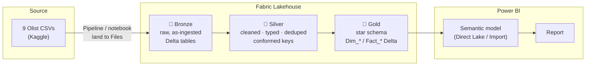

# Data Engineering: Medallion architecture (Microsoft Fabric)

This tier shows the **same model promoted to a governed Fabric pipeline**. It is documented and captured once
(screenshots + committed code), not hosted; the public artifact stays the Import-mode Power BI report. Together
they demonstrate the DP-600 (Fabric Analytics Engineer) and DP-700 (Fabric Data Engineer) skill set: a Lakehouse,
a medallion architecture, PySpark transforms writing Delta, and a Direct Lake-ready semantic model.

## Architecture

## Layers

| Layer | What it holds | Transforms |
|---|---|---|
| **Bronze** | Raw CSVs landed verbatim as Delta tables, one per file. No typing, no filtering, just a faithful, replayable copy of source. | Read CSV → `write.format("delta").mode("overwrite")`. |
| **Silver** | Cleaned and conformed: explicit types, parsed timestamps, deduped reviews (latest per order), the category translation joined on, trimmed text keys. | Type casts, `dropDuplicates`, window for latest review, left-join translation. |
| **Gold** | The dimensional model that Power BI consumes: `Dim_Date`, `Dim_Customer`, `Dim_Product`, `Dim_Seller`, `Fact_Orders`, `Fact_OrderItems`. Same grain and columns as the TMDL model in `/report`. | Build dims (distinct), derive `delivery_days` / `is_late`, denormalise `customer_id` + `purchase_date` onto the line fact. |

## Tool choices & why

- **Lakehouse over Warehouse.** The source is files and the transforms are column-shaping at scale → Spark + Delta in a
  Lakehouse is the natural fit. A Warehouse (T-SQL) would suit a set-based, SQL-first team; here PySpark keeps ingestion,
  cleaning, and modeling in one notebook.
- **Medallion (bronze/silver/gold).** Separates concerns: bronze is replayable raw history, silver is the trusted
  cleaned layer reusable by other workloads, gold is purpose-built for BI. Re-running from any layer is cheap.
- **Delta tables.** ACID writes, schema enforcement, time travel, and they're **Direct Lake-ready**, so the same gold
  tables can back a Direct Lake semantic model with no import step.
- **PySpark over Dataflows Gen2 here.** The logic is explicit, version-controlled, and testable as code. Dataflows Gen2
  would be the low-code alternative for citizen developers; the trade-off is reviewability, which a portfolio should favour.
- **Why also keep the Import-mode report.** The public, always-available artifact must not depend on a live capacity.
  The Import model in `/report` is the deliverable; this Fabric slice is the *engineering proof* behind it.

## How this was captured (one-time, on the free 60-day Fabric trial)

1. Created a Lakehouse; uploaded the 9 CSVs to **Files**.
2. Ran `bronze_silver_gold.ipynb` end-to-end (bronze → silver → gold Delta tables).
3. Screenshotted the Lakehouse object explorer, the pipeline/notebook run, and the gold tables → `./screenshots/`.
4. Committed the notebook + this doc. Paused/expired the capacity. Cost: **$0**.
